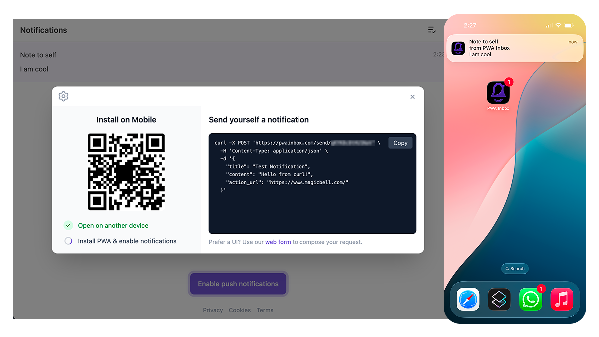

# About this project

[PWAInbox](https://pwainbox.com) is a  Progressive Web Application that provides a real-time notification inbox, powered by [MagicBell](https://www.magicbell.com/).

On app load, the visitor is assigned a unique inbox URL (e.g. `https://pwainbox.com/abc123`) that they can use to receive notifications. The inbox supports both web push notifications and in-app notifications, making it a versatile tool for personal reminders, workflow alerts, and more.

Note that this also works on iOS. The ability to receive push notifications from a web app on an iPhone is a relatively new capability (introduced in iOS 16.5).

## Use Cases

- **Send things to yourself** — Use your inbox URL as a personal notification endpoint. Fire off a quick `curl` or HTTP POST from anywhere to send yourself a reminder, link, or note.
- **Final step in an automated workflow** — Add your inbox as the last action in a Zapier zap, Make scenario, or any automation pipeline. Get a push notification when your workflow completes.
- **Let others send things to you** — Share your inbox URL so colleagues, friends, or services can push notifications to you without needing your email or phone number.
- **Throwaway notification channels** — Spin up a new inbox for a specific topic or event. PWA technology makes it trivially easy to install a dedicated app for each notification channel — and just as easy to delete when you no longer need it. Super lightweight compared to native apps.
- **One app per topic** — Instead of a single app with a "notification settings" screen, create a dedicated PWA for each topic you care about. Subscribe only to what matters, uninstall what doesn't. ([via @Matt0xley](https://x.com/Matt0xley/status/2023406023873372314))

<div align="center">
  <video src="public/noti_received2_sm.mp4" width="315" autoplay loop muted playsinline></video>
  <p><a href="https://youtube.com/shorts/fLPRCH44eUs">Watch the full demo on YouTube</a></p>
</div>

## Why a PWA?

A native app is overkill for a throwaway notification channel. PWAs hit the sweet spot - they install in seconds from the browser, show up on your home screen with their own icon and badge count, and support real push notifications. There's no app store, no review process, no 200MB download.

More importantly, PWAs are disposable by design. Need alerts for a weekend project? Install it. Project's done? Long-press, delete - gone. No account to deactivate, no leftover background processes. This makes the "one app per topic" model practical in a way that native apps never could be.

## Testimonials

> "Neat, I really like this idea, this is a clever use of PWAs. I'm really enjoying this cleaner version of Zap notifications as a push notification. Easier to organize than having these things go to Slack or Email. Very nice build!"
> — [XRay-Tech on r/zapier](https://www.reddit.com/r/zapier/comments/1r669aq/comment/o62uumv/)

> "This is slick — a lightweight PWA inbox for Zapier outputs is such a clean hack. The unread count on the app icon alone makes it feel way more native than expected. Perfect for monitoring Zaps without adding Slack/email noise."
> — [Vaibhav_codes on r/zapier](https://www.reddit.com/r/zapier/comments/1r669aq/comment/o5obyqf/)

> "Neat idea!"
> — [01908directory on r/PWA](https://www.reddit.com/r/PWA/comments/1r1680r/comment/o4nhx6k/)


## Stack

- **Preact 10** with SSR via `preact-render-to-string`
- **Hono** for server-side routing
- **Vite 6** with `@cloudflare/vite-plugin` and `@preact/preset-vite`
- **Tailwind CSS 4** via `@tailwindcss/vite`
- **Cloudflare Workers** for deployment
- **MagicBell** for notifications, inbox UI, and web push

## Getting Started

### Prerequisites

- Node.js 18+
- A [Cloudflare](https://dash.cloudflare.com/) account
- MagicBell API credentials (API key and secret)

### Setup

```sh
npm install
```

Create a `.dev.vars` file with your MagicBell credentials:

```
API_KEY=your_api_key
API_SECRET=your_api_secret
```

### Development

```sh
npm run dev
```

### Deploy

```sh
npm run deploy
```

Before your first deploy, set the production secrets:

```sh
npx wrangler secret put API_KEY
npx wrangler secret put API_SECRET
```

## How It Works

1. Visiting `/` generates a unique ID and redirects to `/:id`
2. The worker generates a JWT token for the inbox and SSR-renders the page
3. The client hydrates with the MagicBell Inbox component
4. On mobile, a dialog prompts to enable push notifications via PWA install
5. On desktop, a dialog shows a QR code for mobile setup and a curl snippet for testing

## Project Structure

```
src/
  index.tsx          # Worker entry point (Hono routes, SSR)
  client.tsx         # Client entry point (hydration)
  App.tsx            # Main Preact component
  styles.css         # Tailwind + MagicBell style overrides
  components/        # UI components (Dialog, SendTestButton, etc.)
  lib/               # Shared utilities (JWT, echo, badge sync, etc.)
  templates/         # Service worker template
```
